# Текст для презентации
## 1. Вступление

## 2. Вспоминаем как запускается java приложение
### 2.1 plain classpath

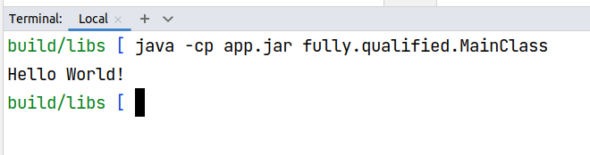

### 2.2 plain jar

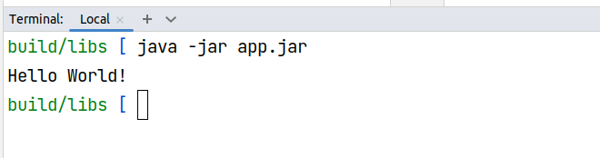  

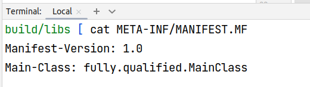  

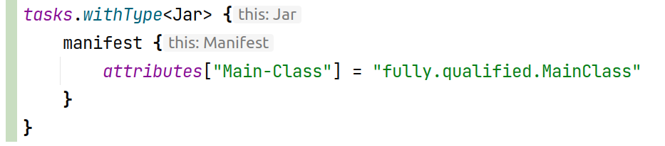


### 2.3 plain java modules

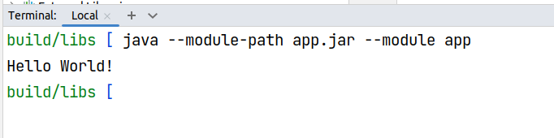

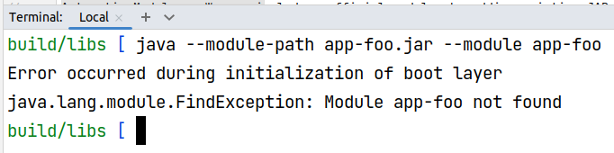

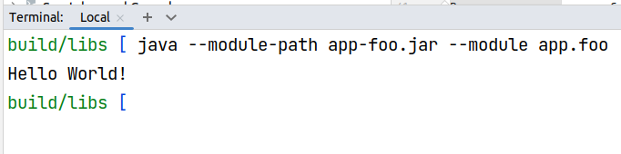

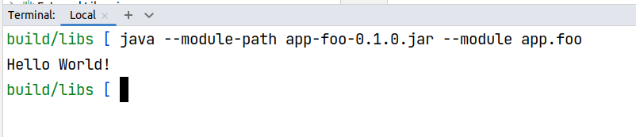


#### 2.3.1 почему это работает
 * System Modules - модули jdk
 * Application Modules - модули уровня приложения подготовлены с использованием инструментария, 
содержат определения модуля в 
 * Automatic Modules - "неофициальные модули", можно добавить существующие jar файлы в module-path, название модуля будет
произведено на основе имени файла
 * Unnamed Module - к неименованному модулю будут добавлены все классы и jar, добавленные 
в classpath но не через module-path 

#### 2.3.2 требования
У модуля есть требования к его наименованию. Имя в нижнем регистре, разделитель точка. При этом
можно использовать либо стиль наименования проектов (app.module), либо reverse.dns (org.company.app.module). Например модули jdk 
имеют такие наименования java.desktop, java.logging, jdk.xml.dom

# 3. Как запускается spring boot приложение
## 3.1 spring jar

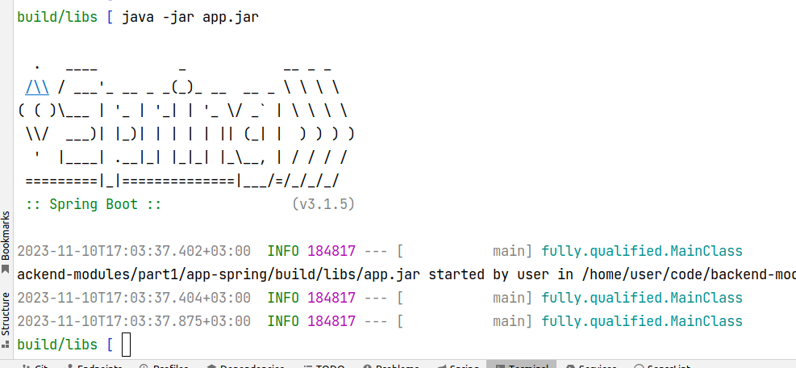

## 3.2 spring classpath


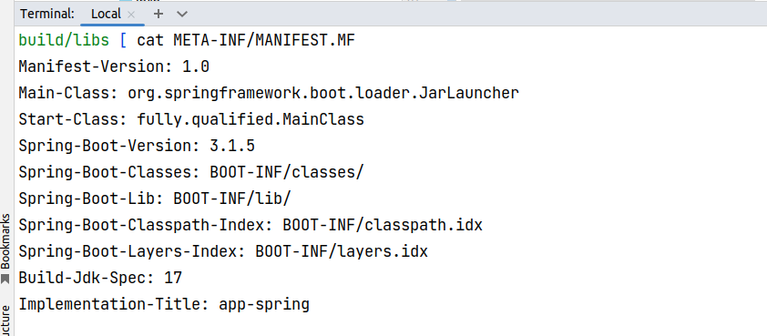

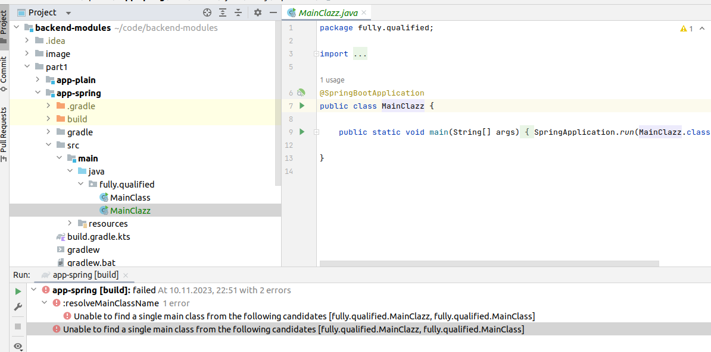


```text
Launcher - create class loader, load start class
      |
    ExecutableArchiveLauncher - classpath.idx, layers.idx
      |  |
      | JarLauncher - psvm
      |          
    PropertiesLauncher - psvm
```

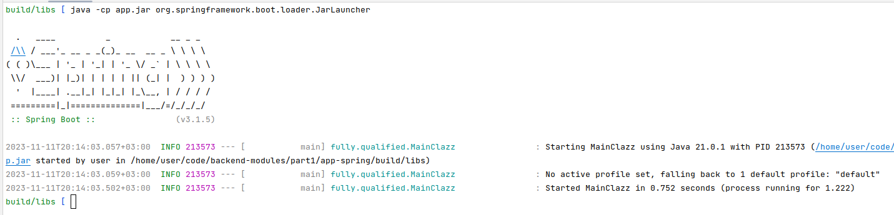

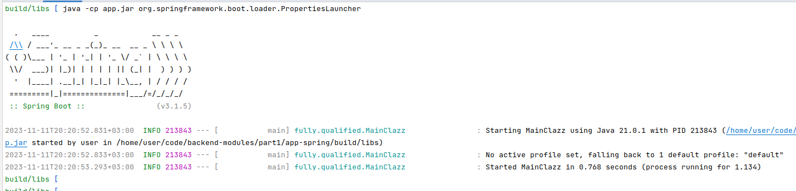

## 3.3 spring java modules

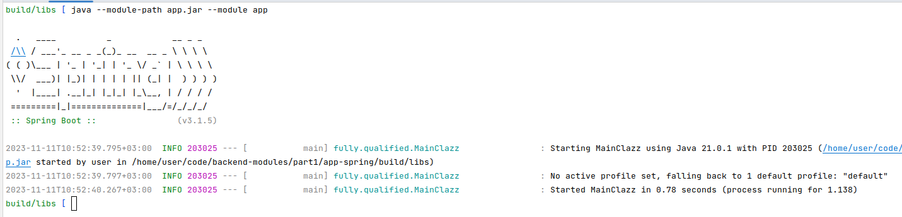
С помощью лаунчера PropertiesLauncher и ключа loader.path мы можем указать спрингу, что ещё нужно догрузить и 
инициализировать, помимо основного jar.

# 4. Варианты сформировать classpath на этапе старта приложения
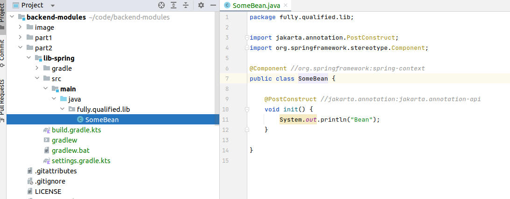

| Вариант старта                                                                                 | Бин загружен |
|------------------------------------------------------------------------------------------------|--------------|
| java -cp 'app.jar:./modules/*' org.springframework.boot.loader.JarLauncher                     | Нет          |
| java -Dloader.path='./modules/' -cp app.jar org.springframework.boot.loader.PropertiesLauncher | Да           |
| java --module-path 'app.jar:./modules/*' --module app                                          | Нет          |


## 2. Изучаем как запускается spring boot приложение (JarLauncher, PropertiesLauncher)

**classpath.idx** - определяет последовательность добавления jar в classpath  
**layers.idx** - позволяет разделить jar на логические слои для создания докер образа  
**org.springframework.boot.loader.jar.JarFile** - основной класс для загрузки файлов из стандартного местоположения и из 
вложенных jar файлов. При первой загрузке местоположение каждого JarEntry c физическим смещением в основном jar
Вооружившись этой информацией, мы можем загрузить определенные вложенные записи, обратившись к соответствующей части 
основного jar. Нам не нужно распаковывать архив, и нам не нужно считывать все входные данные в память.


