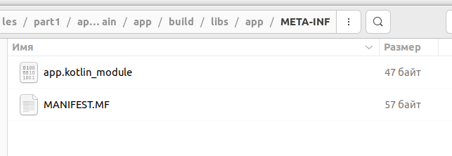
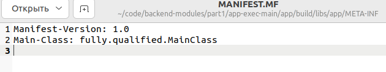

# Текст для презентации

```shell
java -jar app.jar
```

```kotlin
tasks.withType<Jar> {
    manifest {
        attributes["Main-Class"] = "tech.bvd.app.AppKt"
    }
}
```

```shell
Hello World!
```



